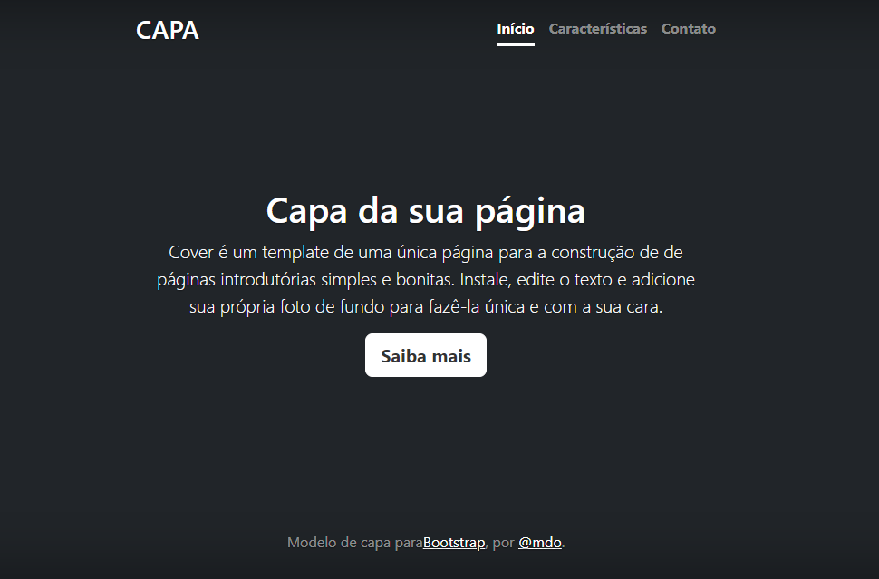

# Projeto de  portfólio pessoal

Projeto criado utilizando exemplo do Bootstrap para ensino de uso do README e Bootstrap. 

## 🚀 Descrição 
 Esse é um progeto, de Portifólio pessoal para personalizar do jeito que quizer, e ficar uma página simples e bonita.

## 🔧 Funcionalidades 
A página pode ser persomalizada com fotos, escritas, cores.

### tecnologias utilizadas
* VScode 
* GitHub
* Git 
* Captura de tela
* css 
* Readme
* html 
* google 
* pasta 
* tens

## fontes consultadas

* [Alura](alura.com.br/artigos/escrever-bom-readme#referencias-de-readme) - Como escrever um README incrível  

* [Bootstrap](https://getbootstrap.com/docs/5.0/getting-started/introduction/)  

* [lohhans](https://gist.github.com/lohhans/f8da0b147550df3f96914d3797e9fb89)

## Autores
Ana Paula  
[Github](https://github.com/anapaulacd/portiforio_pessoal)  
[Linkedin]()  
Orientador Leonardo  
[Github](https://github.com/LeonardoRochaMarista)  

